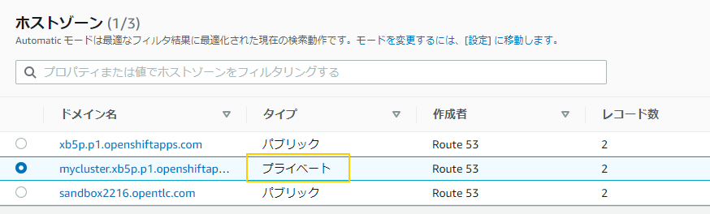
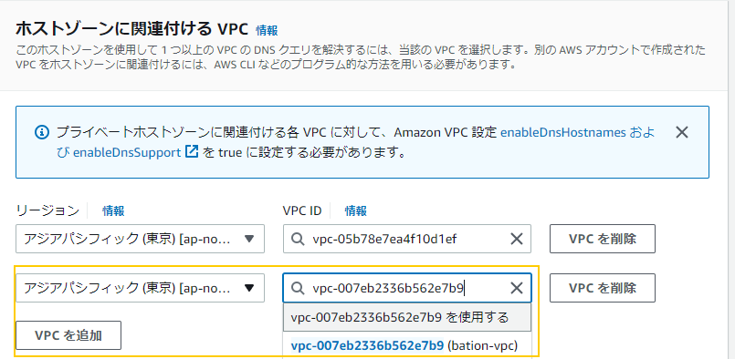

# はじめに

ROSA HCP でも、ROSA Classic とネットワークの構成は同じですが、HCP の Controlplane にアクセスするために、ユーザーの VPC 内に作られる Endpoint に対して、別の VPC からアクセスする場合に、そのネットワークからのアクセス許可を与える必要があります。

その部分を追加で書いた手順を書くついでに、全体を見直したドキュメントを作る事にしました。

# 作業環境のセットアップ

以下の環境をセットアップされている環境を前提としています。

- AWS CLI 
- rosa コマンド
- jq コマンド (optional)

## AWS CLI のインストール
AWS CLI のインストールは、[こちらの AWSのページを参照して下さい](https://docs.aws.amazon.com/ja_jp/cli/latest/userguide/getting-started-install.html)
インストール後、作業対象の AWS アカウントの情報を入力します。

```
$ aws configure
AWS Access Key ID [****************PUMH]: ABCDEIFGHIJKPUMH           # 管理者から教えてもらってください
AWS Secret Access Key [****************Ztkt]: abcdefghijkZtkt　　　　 # 管理者から教えてもらってください
Default region name [ap-northeast-1]: ap-northeast-1 
Default output format [None]: 
$ 
```

## oc コマンド / rosa コマンドのインストール
`oc` コマンドや、`rosa` コマンドが必要です。

`rosa` コマンドは、[こちらか](https://console.redhat.com/openshift/downloads)、もしくは[こちから](https://mirror.openshift.com/pub/openshift-v4/clients/rosa/latest/)ダウンロード可能です。

`oc` コマンドは、`rosa` コマンドを使って以下のコマンドラインでインストール可能です。

```
rosa download oc
```

Linux の場合は、[こちら](https://gist.github.com/yuhkih/d9760d16084aa79812428e64ce0ec5d9) に `oc` コマンドと `rosa` コマンドをインストールするシェルを書きました。

## jq のインストール

jq コマンドは Ubuntu の場合は、
```
 sudo apt-get install jq
 ```

RHEL系 (Amazon Linux等) の場合は、
```
 sudo yum install jq
```
でインストール可能です。

# この Repository のクローン

自分の端末上で以下のコマンドを実行して、このレポジトリーをローカルにダウンロードします。

```
git clone https://github.com/yuhkih/rosa-hcp-nw-template.git
cd rosa-hcp-nw-template
```

作業に必要な CloudFormation の Template や、sh 等は `rosa-nw-template` ディレクトリに含まれています。


# 踏み台用 VPC / Transit Gateway と踏み台のデプロイ


1. 以下の CloudFormation のテンプレートを使用してスタックを作成します。

    Single AZ の　ROSA をデプロイした場合

   ```
    bastion-vpc-and-transit-gw-sz.yaml
    ```

    Multi AZ の ROSA をデプロイした場合

    ```
    bastion-vpc-and-transit-gw-mz.yaml
    ```

   AWS CLI から Single AZ 用の bastion VPC を作成するために CloudFormation を実行する場合は以下のようになります。
   
   ```
   aws cloudformation deploy --template-file bastion-vpc-and-transit-gw-sz.yaml --stack-name mybastion
   ```

   この CloudFormation Template によって、 Bastion 用の VPCとTransit Gateway が構成されます。

    Single AZ 構成の場合は以下の図の左側の VPC と踏み台となる 2つの EC2、ROSA VPC と接続するための Transit Gatway が環境が構築されます。

     

1. ROSA の VPC の Route 53 の 設定を編集します。

    このままでは、踏み台用に作成した VPC から ROSA で使用されているプライベートなドメインを解決できないため、ROSA の プライベートドメインの Zone の設定を編集して、新しく作成した踏み台用の VPCを信頼するように設定します。

    Route53の画面で`プライベート`の Zone を探します。
    

    `プライベート`Zone の設定の`ホストゾーンに関連付けるVPC`で、bastion VPＣを指定します。
    
    これで、Bastion 側から ROSAのドメインの名前解決ができるようになります。
    設定後、名前解決ができるようになるまで、1分以上かかるかもしれません。

    (サポート内に収める方法としては、必要なドメイン名とホスト名を bastion の /etc/hosts に登録しておく方法もあります。その場合は、IPアドレスが変わる可能性があるので定期的にメンテする必要が出てくるかもしれません)
# SSH Port foward の設定と Bastion へのログイン

## CLI ログイン環境のセットアップ
Private Subnet に接続された Bastion にログインするには、SSH Port Forward を設定する必要がありますが、ここでは手順をシェル化しています。

SSHの鍵は CloudFormation で Bastionがデプロイされた時に AWS 上に保管されたものを、シェル内でダウンロードして使用しています。

1. Linux の端末を2つ用意します。

1. Linux 端末1で以下のコマンドを実行します。

    Publicネットワークにある踏み台 EC2 サーバーにログインします。
    
    ```
    port-forward.sh 1
    ```

     

    ログアウトせずに、接続を保ったままにします。

1. Linux 端末2で以下のコマンドを実行します。

    Privateネットワークにある踏み台 EC2 サーバーにログインします。
    ```
    port-forward.sh 2
    ```

     

    この端末から oc コマンドなどが実行できるはずです。`oc version` が実行できるか確認してみて下さい。
    - 踏み台サーバー作成時に oc コマンド等が自動でインストールされているはずですが、まれに失敗している場合があるので、その場合は手動でインストールして下さい。

    ROSA インストール時に出力された以下の useird / password でログインできるはずです。( URL / usser id / password は、もちろん install された ROSA 毎に違います。)

    ```
    oc login https://api.mycluster.xb5p.p1.openshiftapps.com:6443 --username cluster-admin --password eKrGh-SfrLd-Evak9-abcde
    ```

    ブラウザーのアクセス URL は以下のコマンドで取得できます。

    ```
     oc whoami --show-console=true
     ```

## ブラウザアクセスのセットアップ

幾つかの場面では、GUI が使えた方が便利なケースがあります。
上記の SSH Port Forward の設定をした後、以下の作業を行います。

1. 踏み台サーバーから、openshift console の名前を に解決します。

    ```
    dig +short console-openshift-console.apps.mycluster.xb5p.p1.openshiftapps.com 
    10.0.1.44
    10.0.1.173
    ```
    
    このIPアドレスを覚えておきます。

1. hosts ファイルを編集します。

    `/etc/hosts` ファイル (Windows の場合は、`C:\Windows\System32\drivers\etc\hosts`) に以下のエントリーを作成します。IPが複数ある場合は、どちらか一つを追加すれば大丈夫です。

 
    ```
    10.0.1.44    .apps.mycluster.xb5p.p1.openshiftapps.com   
    ```

    > - apps 以降のドメイン名はユーザー環境によって違います。

1. ブラウザーに Socks サーバーを設定します。
    
    Firefox の例ですが、「Network Settings」で以下のように設定します。

    - localhost の 10044 ポート を Proxy 先として指定します。
    - Proxy DNS when using SOCKS v5 にチェックを入れます。

    
# rosa-hcp-nw-template
