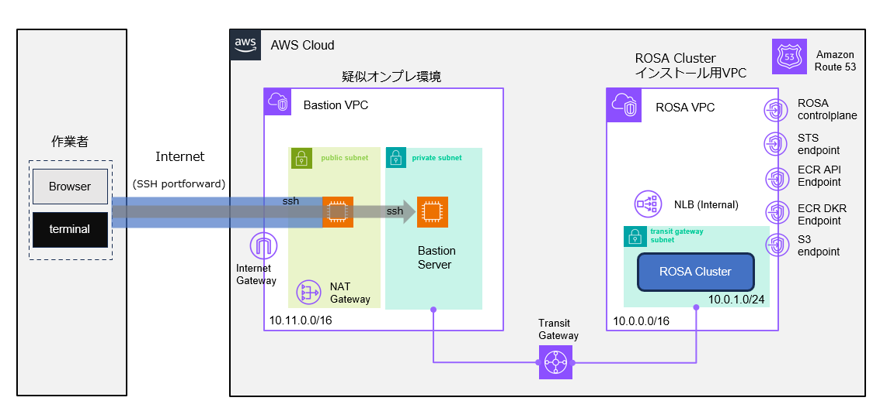
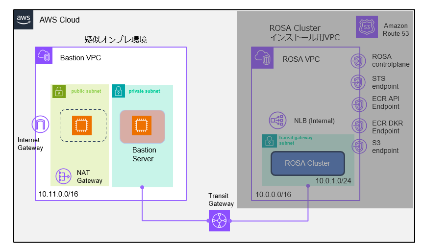

# 1. はじめに

このリポジトリーの CloudFromation は、ROSA 環境でのネットワークトラフィックを観察するために作られたものです。
デプロイされた環境を使う事で、ROSA HCP Cluster を Private Cluster として作成した時に、どのような通信が Egress として発生するかが確認できます。

このレポジトリーの CloudFormation を使用する事で、以下のような実験環境を構築できます。

## 作成する環境

この環境は、完全な Private クラスター環境を想定した実験環境です。以下のような環境を作る事を目的としています。



作業者はインターネット越しに環境にアクセスしますが、接続は SSH で暗号化されています。作業者の端末からは、ROSA クラスタにブラウザ、CLIでアクセスできます。
AWS ではインターネットから `Private Subnet` に直接アクセスできません。そのため、`Public Subnet` の EC2インスタンスを経由して、`Private Subnet` の EC2インスタンスにアクセスしています。EC2インスタンスが2つ必要なのはそのためです。
Public Subnet に設置した、EC2に `Security Group` は `Port 22 (SSH)` のみを開けています。さらに Source IP アドレスの条件を付けて、セキュリティを強化する事も可能です。


# 2. 作業環境のセットアップ

以下の環境をセットアップされている環境を前提としています。

- AWS CLI 
- rosa コマンド
- jq コマンド (optional)

## AWS CLI のインストール
AWS CLI のインストールは、[こちらの AWSのページを参照して下さい](https://docs.aws.amazon.com/ja_jp/cli/latest/userguide/getting-started-install.html)
インストール後、作業対象の AWS アカウントの情報を入力します。

```
$ aws configure
AWS Access Key ID [****************PUMH]: ABCDEIFGHIJKPUMH           # 管理者から教えてもらってください
AWS Secret Access Key [****************Ztkt]: abcdefghijkZtkt　　　　 # 管理者から教えてもらってください
Default region name [ap-northeast-1]: ap-northeast-1 
Default output format [None]: 
$ 
```

## oc コマンド / rosa コマンドのインストール
`oc` コマンドや、`rosa` コマンドが必要です。

`rosa` コマンドは、[こちらか](https://console.redhat.com/openshift/downloads)、もしくは[こちから](https://mirror.openshift.com/pub/openshift-v4/clients/rosa/latest/)ダウンロード可能です。

`oc` コマンドは、`rosa` コマンドを使って以下のコマンドラインでインストール可能です。

```
rosa download oc
```

Linux の場合は、[こちら](https://gist.github.com/yuhkih/d9760d16084aa79812428e64ce0ec5d9) に `oc` コマンドと `rosa` コマンドをインストールするシェルを書きました。

## jq のインストール

jq コマンドは Ubuntu の場合は、
```
 sudo apt-get install jq
 ```

RHEL系 (Amazon Linux等) の場合は、
```
 sudo yum install jq
```
でインストール可能です。

## ROSA の有効化

[こちら](https://yuhkih.github.io/mcs-docs/docs/rosa-hcp/create-delete/rosa-hcp-enable/) の手順を実行して AWS コンソール上から ROSA を有効化し、Red Hat アカウントとリンクさせてください。

## ROSA 作成用の Token の取得

[こちら](https://yuhkih.github.io/mcs-docs/docs/rosa-hcp/create-delete/rosa-hcp-get-token/) の手順を実行して CLI から ROSA を作れるようにセットアップしてください。


## この Repository のクローン

自分の端末上で以下のコマンドを実行して、このレポジトリーをローカルにダウンロードします。

```
git clone https://github.com/yuhkih/rosa-hcp-nw-template.git
cd rosa-hcp-nw-template
```

作業に必要な CloudFormation の Template や、sh 等は `rosa-nw-template` ディレクトリに含まれています。

# 3. CF を使った ROSA 用の VPC と Private Network のデプロイ

以下の CloudFormation のテンプレートを使用して、ROSA をインストールするためのネットワークを作成します。

ROSA の Private Cluser (with PrivatreLink) 構成では、ユーザーが自分で必要なネットワークを AWS 内にデプロイした後、ROSA をインストールする必要があります。

Single AZ の実験環境を作成します。

```
rosa-PRV-sz.yaml
```

を使用して、デプロイ完了まで待ちます。AWS GUIから上記の YAML をインポート可能です。

CLI から CloudFormation を使って実行する場合は以下のようになります。

```
aws cloudformation deploy --template-file  rosa-PRV-sz.yaml --stack-name myROSANetwork --capabilities CAPABILITY_NAMED_IAM
```

実行ログなどは、AWS Console 上から確認した方がわかりやすいかもしれません。

この Cloud Formation を実行する事で、以下のような環境が作成されます。


本来であれば、この VPC には、Private Subnet だけを置いて、Egress 用の VPC を分割した方が理解しやすい所ですが、そうなると環境作成の時間もコストもかかるので、このようなネットワーク構成にしています。
ROSA の PrivateLink クラスターを Private Subnet に作成した場合、Load Banalcer の持つ IP も Private の IP になり、外からトラフィックが入ってくる事はありません。

## 変数の準備

後続の手順で使うために、サブネットIDを変数にセットしておきます。

jq コマンドをインストールしている場合は、AWS CLI で以下のように取得できます。

・Single AZ の場合 ( Private Subnet は 1つです)

```
export SUBNET_IDS=`aws ec2 describe-subnets | jq -r '.Subnets[] | [ .CidrBlock, .SubnetId, .AvailabilityZone, .Tags[].Value ] | @csv' | grep Private-Subnet1 | awk -F'[,]' '{print $2}' | sed 's/"//g'`
```

後続の手順で使うために、Cluster名の変数をセットしておきます。

```
export CLUSTER_NAME=myhcpcluster
```

後続の手順で使うために、AWS Region 名の変数をセットしておきます。

```
export REGION=ap-northeast-1
```

# 4. ROSA Private Cluster のインストール

以下の変数がセットされている事を今一度、確認します。


```
echo $SUBNET_IDS
```

```
echo $CLUSTER_NAME
```

```
echo $REGION
```


上記の変数のセットが確認できたら、以下の手順書に進み Private Cluster をインストールします。


```
rosa create cluster --cluster-name=$CLUSTER_NAME --sts --hosted-cp  --region=$REGION --subnet-ids=$SUBNET_IDS -i --private  -y -m auto
```


# 5. CF を使った Bastion 用の VPC 作成と、踏み台 EC2 のデプロイ 

踏み台を ROSA Cluster とは別の VPCにデプロイし、Transit Gateway 経由で ROSA Cluster にアクセスする方法です。


## CloudFormation テンプレートの実行 

以下の CloudFormation のテンプレートを使用してスタックを作成します。

```
bastion-vpc-and-transit-gw-sz.yaml
```

AWS CLI から bastion VPC を作成するために CloudFormation を実行する場合は以下のようになります。
   
```
aws cloudformation deploy --template-file bastion-vpc-and-transit-gw-sz.yaml --stack-name mybastion --parameter-overrides VPCwithOnlyPrivateSubnet=true
```

この CloudFormation Template によって、 Bastion 用の VPCとTransit Gateway が構成されます。

以下の図の左側の VPC と踏み台となる 2つの EC2、ROSA VPC と接続するための Transit Gatway が環境が構築されます。
左側に設置された VPC は、踏み台を使って、隣の Cluster のある VPCを覗くための VPCで、Cluster のある VPC からの egress トラフィック(インターネットに出るトラフィック）はこの VPCを通過しません。

 


## Route 53 の設定の編集

ROSA の VPC の Route 53 の 設定を編集します。

Default の状態では、Cluster のある VPC からのみ Private ゾーンの名前解決ができるようになっています。
このままでは、踏み台用に作成した VPC から ROSA で使用されているプライベートなドメインを解決できないため、ROSA の プライベートドメインの Zone の設定を編集して、新しく作成した踏み台用の VPCを信頼するように設定します。


Route53の画面で `openshiftapps.com`  というドメイン名を含む `プライベート`の Zone を探します。


「ホストゾーンを編集」 => 「プライベートZone の設定」の「ホストゾーンに関連付けるVPC」 => 「VPCを追加」 で、bastion VPC を指定します。


これで、Bastion 側から ROSAのドメインの名前解決ができるようになります。
設定後、名前解決ができるようになるまで、1分以上かかるかもしれません。

## VPC Endpoint のアクセス許可

Default の状態では、Security Group の設定により、Cluster のある VPC からのみ Controlplane に繋がる Endpoint へのアクセスが可能になっています。
このままでは、踏み台用に作成した VPC から ROSA への oc コマンドが実行できないため、設定を変更します。


「VPC ダッシュボード」 ＝＞「エンドポイント」の画面に行きます。

`Interface` タイプで、`サービス名` が 「com.amazonaws.vpce.ap-northeast-1.vpce-svc-<ランダム>」の名前になっているものの 「VPC エンドポイントID」 の チェックボックス を選択します。(Gatewayタイプは、AWS Firewall の vpc endpoint で、それ以外は踏み台の Session Manager で必要 Endpointです。)


下の画面にスクロールして、「セキュリティグループ」タブから「グループＩＤ」をクリックします。


「セキュリティグループID」が、一つ前のステップの「グループID」と同じである行のチェックボックスを選択し、画面下部にある「インバウンドルール」タブをクリックします。


「インバウンドルール」として、プロトコル `HTTPS` / ソース `10.11.0.0/16` (bastion 用の VPC の CIDR) というエントリーを作成します。


# 6. SSH Port foward の設定と Bastion へのログイン

## CLI ログイン環境のセットアップ
Private Subnet に接続された Bastion にログインするには、SSH Port Forward を設定する必要がありますが、ここでは手順をシェル化しています。

SSHの鍵は CloudFormation で Bastionがデプロイされた時に AWS 上に保管されたものを、シェル内でダウンロードして使用しています。

1. Linux の端末を2つ用意します。

1. Linux 端末1で以下のコマンドを実行します。

    Publicネットワークにある踏み台 EC2 サーバーにログインします。
    
    ```
    port-forward.sh 1
    ```

    


    ログアウトせずに、接続を保ったままにします。

1. Linux 端末2で以下のコマンドを実行します。

    Privateネットワークにある踏み台 EC2 サーバーにログインします。
    ```
    port-forward.sh 2
    ```

    


    この端末から oc コマンドなどが実行できるはずです。`oc version` が実行できるか確認してみて下さい。
    - 踏み台サーバー作成時に oc コマンド等が自動でインストールされているはずですが、まれに失敗している場合があるので、その場合は手動でインストールして下さい。

    ROSA インストール時に出力された以下の useird / password でログインできるはずです。( URL / usser id / password は、もちろん install された ROSA 毎に違います。)

    ```
    oc login https://api.mycluster.xb5p.p1.openshiftapps.com:6443 --username cluster-admin --password eKrGh-SfrLd-Evak9-abcde
    ```

    ブラウザーのアクセス URL は以下のコマンドで取得できます。

    ```
     oc whoami --show-console=true
     ```

## ブラウザアクセスのセットアップ

幾つかの場面では、GUI が使えた方が便利なケースがあります。
上記の SSH Port Forward の設定をした後、以下の作業を行います。

1. 踏み台サーバーから、openshift console の名前を に解決します。

    ```
    dig +short console-openshift-console.apps.mycluster.xb5p.p1.openshiftapps.com 
    10.0.1.44
    10.0.1.173
    ```
    
    このIPアドレスを覚えておきます。

1. hosts ファイルを編集します。

    `/etc/hosts` ファイル (Windows の場合は、`C:\Windows\System32\drivers\etc\hosts`) に以下のエントリーを作成します。IPが複数ある場合は、どちらか一つを追加すれば大丈夫です。

 
    ```
    10.0.1.44    .apps.mycluster.xb5p.p1.openshiftapps.com   
    ```

    > - apps 以降のドメイン名はユーザー環境によって違います。

1. ブラウザーに Socks サーバーを設定します。
    
    Firefox の例ですが、「Network Settings」で以下のように設定します。

    - localhost の 10044 ポート を Proxy 先として指定します。
    - Proxy DNS when using SOCKS v5 にチェックを入れます。
    


# 7. 環境の削除

**ROSA HCP Cluster の削除**

ROSA HCP Cluster の削除

```
rosa delete cluster -c $CLUSTER_NAME -y
```

Operator Role と OIDC Config の削除 

パラメーターは、`rosa delete cluster` を実行した時に表示されます。

```
rosa delete operator-roles --prefix <prefix> -m auto -y
rosa delete oidc-provider --oidc-config-id <oidc config id> -m auto -y
```

**CloudFormation Stack の削除**

CloudFormation の Template は依存関係をもっているので、 `bastion VPC` or `Proxy Server` => `ROSA HCP VPC` の順で削除する必要があります。

タイミングによって失敗する事もありますが、再実行するとほとんどのケースでうまく行きます。エラーの詳細などは、AWS GUI を見た方がわかりやすいです。

bastion VPC の削除

```
aws cloudformation delete-stack --stack-name mybastion
```

bastion VPC の削除待ち

```
aws cloudformation wait stack-delete-complete --stack-name mybastion
```

  
ROSA HCP 用 VPC の削除

```
aws cloudformation delete-stack --stack-name myROSANetwork
```

ROSA HCP 用 VPC の削除待ち

```
aws cloudformation wait stack-delete-complete --stack-name myROSANetwork 
```
